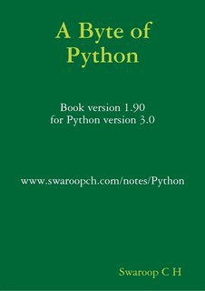

# 1. 标题(mardown语法里分段是中间有空白行，不管你空几行到显示结果里就显示空一行)

# 一级标题
## 二级标题
### 三级标题
#### 四级标题
##### 五级标题
###### 六级标题
####### 没有七级标题，六级是上限   

# 2. 字体

*倾斜字体*
**加粗字体**
***倾斜 and 加粗***
~~删除线~~
<u>下划线</u>
下标~下标~
eg：H~2~O
上标^上标^
eg：x^2^
==高亮文本==


# 3. 引用

>引用是啥，我看看
>>引用是啥，我看看
>>>引用是啥，我看看
>>>>>原来是这有意思，有点类似于Python里的缩进

# 4. 分割线

三个以上的- or * 都行

---
----
***
****
**有点意思**

# 5. 图片


我试试


我再试试本地图片



不错了，还发现了vscode能自动复制相对路径
但是就是图片下边的图片名不显示有点恶心
vscode的路径是反斜杠，这点有点不舒服，好像只有Python是这么玩的

# 6. 超链接
[链接名](链接地址''鼠标放到连接上时显示的名称'')

[某度](http:www.baidu.com''度娘'')

- 引用链接
[名称][ID]

[ID]:待使用的链接

这样玩相当于把链接做成了一个函数，用的时候调用函数就行了
[名称二][ID]

- 链接之前的文本

请参考[标题](#一级标题)


# 7. 列表

- 无序列表
用 - + * 都可以 但是要和内容之间空一行

- 我试试
+ 我再试试
* 我又试试
* 还能自动补充前面的符号，好评
* 不是一个符号的前缀是不一样的无序列表，可以

+ 有序列表
数字加英文的点
1. 我之前写的忘了加点了，我说怎么没有生成列表
2. 还是自动生成序号名，可以
3. 不玩了，差不多了

* 列表的嵌套
  
上下级列表之间敲三个空格键
- 我试试
   * 我试试来了
   * 可以
 * 那两个空格呢？
 * 两个空格还是一级的列表
   1. 有序列表呢？
       - 有序套无需，就是玩

- 任务列表
- [ ] 吃饭
- [ ] 睡觉
- [x] 打豆豆

# 8. 表格

表头|表头|表头
----|:-:|-:
内容1|内容2|内容3
靠左|居中|靠右

其实那个-用一个就行

# 9. 代码

`单行代码`

```
多行代码第一行
    多行代码第二行
        多行代码第三行
```

# 10. 数学公式
数学公式语法和latex的语法一致

单独的数学公式
$$
\frac{\partial f}{\partial x}=\sqrt{a}x
$$
行内数学公式
$
\theta=x^2
$


# 11. 脚注

脚注[^我试试]

[^我试试]:就是简短的试试，但是还是发现了这个脚注要想实现还是要把注释内容写出来之后才行


<iframe src="//player.bilibili.com/player.html?aid=327623069&bvid=BV1JA411h7Gw&cid=171385214&page=1" scrolling="no" border="0" frameborder="no" framespacing="0" allowfullscreen="true"> </iframe>
